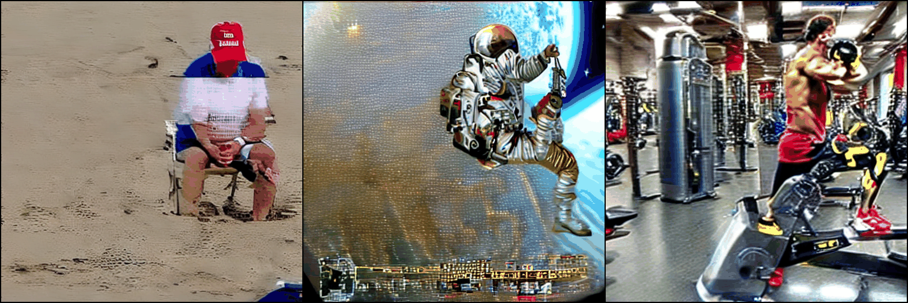

<h2> 🕺🕺🕺 ICT3104 Team 11 2023 💃💃💃 
   
MMPose x FollowYourPose Generation</h2>

 

## Setup Environment
1. Open the repo in colabs, and run the cells in sequentials
2. Follow any instructions on the notebook

## Video
- Original Video

<video src=".\data\input_vid\charades1\charades_video3.mp4" width="320" height="240" controls>
  Your browser does not support the video tag.
</video>

- Resize Video

<video src=".\data\resize_vid\charades_video3_resize.mp4" width="320" height="240" controls>
  Your browser does not support the video tag.
</video>

- Skeleton Video

<video src=".\data\skele_vid\charades_video3_resize_skeleton.mp4" width="320" height="240" controls>
  Your browser does not support the video tag.
</video>

- FollowYourPose Video

<video src=".\data\output_gif\charades_video3_combined.gif" width="320" height="240" controls>
  Your browser does not support the video tag.
</video>

- Superimpose Video

<video src=".\data\output_gif\charades_video3_superimpose_trump.mp4" width="320" height="240" controls>
  Your browser does not support the video tag.
</video>

## 👯👯👯 Acknowledgements

This repository borrows heavily from [FollowYourPose](https://github.com/mayuelala/FollowYourPose) and [mmpose](https://github.com/open-mmlab/mmpose). Thanks the authors for sharing their code and models.
